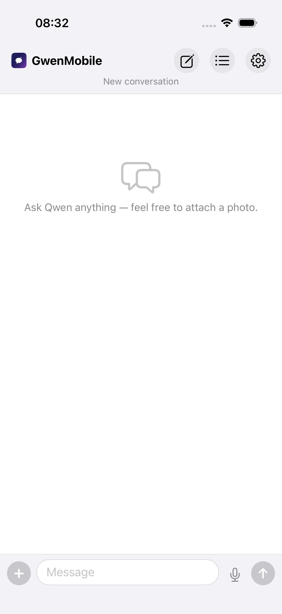
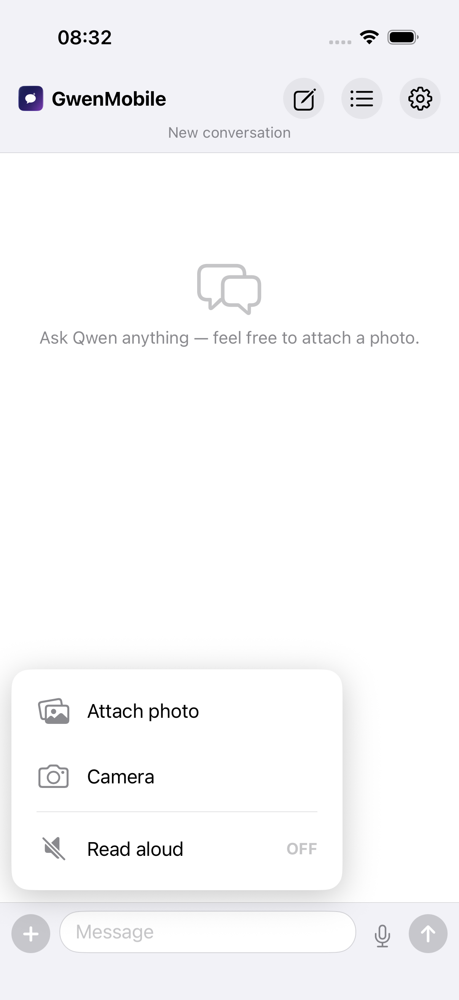
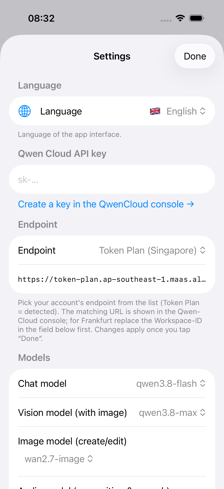

# GwenMobile (iOS)

Native SwiftUI chat app for your Qwen Cloud account (OpenAI-compatible API).
Swift 6, strict concurrency, iOS 17+.

## Features

### Chat & conversations
- Streaming chat answers with a selectable model (e.g. qwen3.8-flash) — already formatted
  while the tokens arrive, not only once the answer is finished
- Compact input bar: a "+" menu holds photo, camera and read-aloud (with visible
  ON/OFF state); mic and send stay one tap away, so the text field is roughly
  twice as wide
- Multiple conversations, persisted locally (JSON + images in the app sandbox)
- API key stored in the Keychain, never in files
- Bilingual UI (German / English), day separators, timestamps, markdown-lite rendering
  (bold, inline code, links) applied to the live stream as well; a marker that is still open,
  like `**` without its partner, simply stays plain text until the closing token arrives
- Branded header: app icon beside the left-aligned "GwenMobile" title, actions right-aligned
- One waiting indicator everywhere the AI is busy and you have to wait — the word
  (`Verarbeite` / `Processing`, or the specific task such as `Erzeuge Bild`,
  `Kümmere mich um den Termin`, `Ich suche im Internet`) plus three dots that count up
  0 → 1 → 2 → 3 every 2 s, in place of any spinning wheel
- Long-press any answer to store it as a Markdown file: it lands in `Documents/answers`
  (visible in the Files app under *GwenMobile*, the app has file sharing enabled) and the
  iOS share sheet opens as well, so it can go to Files, Mail or AirDrop in the same tap.
  Sources of a web-search answer are appended as a numbered `## Quellen` section

 

*After launch (left) and the "+" menu with photo, camera and read-aloud (right).*

### Data graphics from the web
- Ask in one sentence — "such im Internet nach den Einwohnerzahlen und stell sie als Diagramm dar",
  "look up the latest unemployment rates and plot them" — and the app runs the whole chain:
  web search → page text → the chat model distils a **chart plan** (kind, title, unit, 2–8 label/value
  pairs) from **the fetched numbers only** → that plan becomes the prompt for the image model → the
  picture arrives in the chat with the data listed as text and the sources as clickable chips.
- Two independent detection layers, so a chart wish is never missed and a plain question is never
  hijacked: `ChartIntent` decides deterministically on phrasing (needs an explicit chart word such as
  *Diagramm/Grafik/Chart/plot* **plus** a data or research word, and it honours rejections like
  "kein Diagramm", "nur als Text"), and the chat model itself can answer with the protocol tokens
  `[[CHART]]` or `[[SEARCH]][[CHART]]` for everything the phrase lists cannot see. If only the marker
  fires, no search is done and the numbers come from the model's own knowledge.
- The plan is validated, not trusted: values survive `1,5`, `1.234,56`, `1,234.56`, `42 %` and `12,345`,
  broken points are dropped, fewer than two usable numbers aborts with a hint instead of drawing fiction.

### Images
- Attach photos from camera or gallery; the vision model (e.g. qwen3.8-max) sees them
- No switch, no toggle, no separate mode: what you type decides whether you get a
  picture. There is no image-AI on/off control anywhere in the UI.
- **AI image generation**: ask in plain text — "Erzeuge ein Bild von …", "generate a
  picture of …", "draw a logo" — and the message goes straight to the image model
  (e.g. wan2.7-image). A message without attachments becomes an image request as soon
  as it pairs a creation verb (erstelle, erzeuge, generiere, zeichne, male, kreiere,
  create, generate, draw, make) with a picture noun (Bild, Abbild, Illustration, Foto,
  picture, image, photo, logo, poster, wallpaper)
- **AI image editing**: attach an image and describe the change
  ("make the mouse blue") — the image is edited in place, not regenerated
- Smart intent router: every image + instruction is classified as
  EDIT / CREATE / CHAT by the text model, so plain questions about a
  photo still go to the vision chat; if the classifier returns no answer, a
  keyword fallback still routes obvious "create something new" requests to the
  image model and everything else to chat
- Follow-up edits: right after an image answer, just say "make it darker" —
  the previous result is picked up as the input image, no re-attaching
- Long-press any generated image → "Edit" to send it back into the input bar
- Save results to the Photos app (button or context menu)

### Histories and storage
- The header's list button opens "Verläufe": every conversation with its date, message
  and image count and its size on disk. Tap to open, swipe to delete one.
- Long-press any message → "Nachricht löschen" removes exactly that message.
- "Alle Verläufe löschen" (in the history sheet or in Settings → Speicher) removes every
  conversation, the one you are reading included, and immediately opens a fresh empty chat.
  The confirm dialog names the counts and the megabytes before anything happens, and
  "Rückgängig" puts all chats back in their old order with the one you were reading open again.
- Deleted pictures are moved to `Documents/.trash` first, so the snackbar's "Rückgängig" restores the
  conversation and the files. The snackbar times itself out after 5 s (`HistoryCleaner.defaultUndoWindow`)
  and the trash is emptied at that moment; anything still pending is erased on the next app start.
- A picture file is only freed when no remaining message references it any more.
- Settings → Speicher shows the same numbers (images, histories) at a glance.

### Calendar control
- Create, change or delete appointments from chat:
  "Book a dentist appointment tomorrow at 2 pm, one hour, practice Am Markt",
  "move my dentist appointment to tomorrow 16:30", "delete the meeting with Karin"
- Real calendar notifications, not just notes: "first alert 1 hour before,
  second alert 2 hours before" adds matching alarms to the event; naming them
  on an existing appointment replaces them ("alerts every day at...",
  "remove the reminders")
- Relative dates ("tomorrow", "next Monday") are resolved against the device clock
- **Private or work**: "make the dentist appointment private", "book that in my work calendar",
  "leg den Termin privat an" — the app maps that onto the calendars that actually exist on your
  iPhone (Privat/Arbeit, Private/Work, Persönlich, Zu Hause, Home/Homeoffice, …). Saying nothing
  files a new appointment in the **work** calendar, and an existing appointment keeps its calendar
  unless you ask to move it
- "set the calendar to private" on an appointment that already exists moves it there
- A calendar wish never ends up as a note: if the router files "privat" into the note field anyway,
  the app moves it into the calendar choice and drops the note — including a leftover note like
  "privat" from an older appointment, which is cleaned up while moving it
- A calendar you named that does not exist is reported instead of guessed, and the answer lists
  the calendars you have
- Asks for calendar permission on first use
- Every successful action is confirmed in chat with the full appointment data
  (title, day, start–end time, location, calendar)
- Questions about the calendar ("what's on tomorrow?") stay normal chat

### Voice
- Voice input (ASR): the mic button records, transcribes and sends in one step
- Read-aloud of answers (TTS), toggleable per chat
- German: uses the iOS system voice — the cloud audio model's German TTS is not
  good enough yet (its voices are Chinese/English only), so read-aloud falls
  back to AVSpeechSynthesizer and speaks with whichever German voice is
  configured on the device (Settings → Accessibility → Spoken Content →
  Voices → German); the gender shown in Settings mirrors that voice. Note:
  Siri voices (e.g. "Siri, Stimme 2") are not exposed to third-party apps by
  iOS — if one is selected, Apple substitutes the standard voice for the
  language (e.g. Anna). Pick a downloaded (enhanced/premium) non-Siri voice
  to have the app use exactly that voice.
- English: uses the cloud audio model voices (male daniel / female hannah)

#### Hands-free voice trigger (Action button)

Opening `gwenmobile://listen` (registered URL scheme) launches the app and
starts recording immediately. iOS does not let third-party apps listen for a
wake word in the background, so you bind the URL to a physical button once:

1. Create the shortcut: open the Shortcuts app → tap **+** → search for the
   "Open URL" action → add it → tap "URL" in the action and enter
   `gwenmobile://listen` → tap **Done** (top right). Optional: rename the
   shortcut to "Gwen listen".
2. Assign it to the Action button (the small button on the left edge above
   the volume keys, iPhone 16 and later): open Settings → search for
   "Action Button" → choose "Shortcuts" → "Select a Shortcut" → pick your
   shortcut.
3. Use it: press the Action button once → GwenMobile opens and records right
   away (orange mic dot in the status bar). Speak, then tap the red mic to
   send. Recording stops and transcribes automatically after 28 s (the ASR
   server rejects longer audio) — a countdown appears over the input bar in
   the last 10 s.

No Action button on your device (iPhone 15 and earlier)? Use Settings →
Accessibility → Touch → Back Tap → Double Tap → Shortcuts instead, or just
the mic button in the app.

### Settings
- Endpoint picker (Token Plan, DashScope intl/US/CN, EU workspace) + custom base URL
- Model pickers (chat, vision, image, audio) populated from your account (GET /models)
- Language, read-aloud toggle, connection test



*The settings sheet, reached through the gear in the header.*

## Requirements
1. Xcode from the App Store (~40 GB, one-time).
2. A Qwen Cloud account: create an API key at https://home.qwencloud.com/api-keys

## Build & run on your iPhone
```
cd ~/GwenMobile
xcodegen generate          # regenerate the project after file/project.yml changes
open GwenMobile.xcodeproj
```
- Target GwenMobile → Signing & Capabilities → Team = your Apple ID
  (free account is enough for your own device; provisioning expires after 7 days).
- Connect the iPhone, select it as destination (not a simulator), press Run.
- First launch: Settings (gear) → paste API key → "Test connection".
- From the terminal: `xcodebuild ... build` + `xcrun devicectl device install app ...`
  (needs `export DEVELOPER_DIR=/Applications/Xcode.app/Contents/Developer`).

## Tests
The `GwenMobileTests` target holds the unit tests (pure logic: audio codec, intent
heuristics, routing, request building, response decoding, error translation,
localisation, storage, conversation store, stream throttling, answer export, the
waiting-indicator rhythm). No network, no device.
```
xcodegen generate
xcodebuild test -scheme GwenMobile -destination 'platform=iOS Simulator,name=iPhone 17 Pro'
```

### Debug-only feature sweep
`sweep` runs every backend feature once against the real account and writes a report to
the app's Documents folder (`flow_sweep.txt`):

```
xcrun devicectl device process launch --device <UDID> --terminate-existing \
  --payload-url "gwenmobile://test/sweep" com.mortis.gwenmobile
xcrun devicectl device copy from --device <UDID> --domain-type appDataContainer \
  --domain-identifier com.mortis.gwenmobile --source Documents/flow_sweep.txt \
  --destination /tmp/flow_sweep.txt
```
Covered: model list, chat answer, `[[SEARCH]]` trigger, web search + page reads +
research answer, calendar permission status and plan JSON (read-only, no event is
written), image editing, text-to-image, cloud TTS, ASR transport
(silence), conversation persistence and counts. It needs a stored test image
(`img_0B85747A-BAA.jpg`) for the edit probes and skips them when absent.

### Debug-only UI flow tests
Debug builds answer the URL scheme `gwenmobile://test/<scenario>` and drive the real
chat UI on the device (perf regressions for typing, scrolling and image edit).
Scenarios: `typetest`, `scrolltest`, `camtypetest`, `camflow`, `followup`,
`tripleedit`, `bigedit`, `reopenbig`, `editbig`, `camtrans`, plus a bare
`gwenmobile://test/<attachment-file-name>` for a single image. They assume the conversations and image files of the reference
device exist in the app sandbox (`img_0B85747A-BAA.jpg`, `img_7924D952-6BF.jpg`) and
log to the `flow` os-log subsystem. Release builds contain none of this code
(`GwenMobile/DebugFlowTests.swift` is `#if DEBUG`).

The same scenarios can be started without the URL scheme, which is useful when
`devicectl` is unavailable and the app has to be launched through `dvt launch`:

```
python3 -m pymobiledevice3 developer dvt launch "com.mortis.gwenmobile -gwenflowtest scrolltest"
```

Debug builds additionally write a main-thread trace to `Documents/flow_trace.txt`
(`MARK` = flow events, `STALL`/`STALL_END` = main-thread blocks longer than 400 ms with
render counters, `STATS` = counters every 2 s). The stall heartbeat is a `Timer` in
`.common` run-loop modes, so it keeps reporting while a touch is tracked:

```
python3 -m pymobiledevice3 apps pull com.mortis.gwenmobile Documents/flow_trace.txt /tmp/flow_trace.txt
```

## Notes
- `GwenMobile/Info.plist` is the single source of truth for bundle configuration
  (privacy texts, URL scheme). It is not generated — edit the file, `project.yml`
  only points at it via `INFOPLIST_FILE`.
- Default base URL: https://token-plan.ap-southeast-1.maas.aliyuncs.com/compatible-mode/v1
  (Token Plan account, live-tested: chat, vision, image edit, calendar routing).
- Models: qwen3.8-flash (chat/routing), qwen3.8-max (vision), wan2.7-image
  (generation/editing), qwen-audio-3.0-realtime-plus (ASR + English TTS).
  Exact names must exist in your account — check via GET /models; API errors
  are surfaced in the app's error dialogs.
- Image editing is framed with an explicit "edit only, keep composition"
  instruction so the model edits your photo instead of generating a new one.
- All API errors run through one translator: a short message in the app
  language (invalid/expired key, unknown model — named —, rate limit, offline)
  plus the raw code as a small detail line; key/model errors add an
  "Open Settings" button to the alert.
- Camera and calendar permission dialogs only work on real devices (not simulator).
- Generated image URLs expire after ~24 h; the app downloads and stores them
  immediately into its sandbox.
